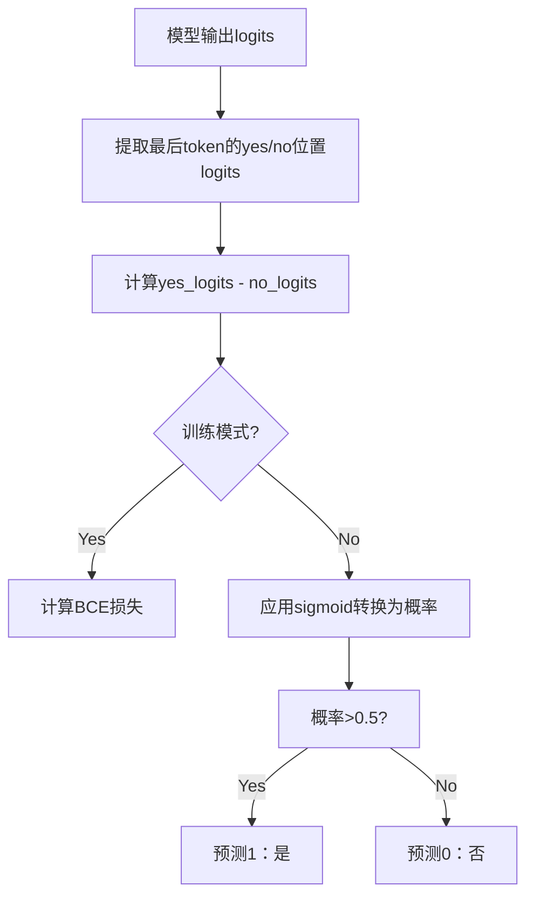

这段代码实现了基于模型推理输出的二分类得分计算逻辑，主要用于判断模型倾向于"是"(yes)还是"否"(no)的二元决策任务。以下是完整的计算逻辑说明：

### 核心计算流程

1. **模型推理**：
   ```python
   outputs = self.model(input_ids=input_ids, attention_mask=attention_mask)
   ```
   - 输入：`input_ids`（分词后的token ID序列）和`attention_mask`（注意力掩码）
   - 输出：`outputs`对象，包含关键属性`logits`（未归一化的预测值张量）

2. **提取关键位置logits**：
   ```python
   yes_logits = outputs.logits[:, -1, self.yes_loc]  # 最后一个token的"是"位置logit
   no_logits = outputs.logits[:, -1, self.no_loc]    # 最后一个token的"否"位置logit
   ```
   - 形状说明：`logits`张量维度为 `[batch_size, sequence_length, vocab_size]`
   - 聚焦序列**最后一个token**（`[:, -1, :]`），因为：
     - 在问答/决策任务中，最后一个token通常包含决策信息
     - 对于生成式模型，这是最终决策点
   - `self.yes_loc`/`self.no_loc`：预定义的"是"/"否"在词表中的位置索引

3. **计算决策得分**：
   ```python
   logits = yes_logits - no_logits
   ```
   - 核心逻辑：通过**差值**衡量模型对"是"的倾向程度
   - 正值 → 倾向"是"
   - 负值 → 倾向"否"
   - 绝对值大小表示置信度强弱

4. **损失计算（训练时）**：
   ```python
   if labels is not None:
       loss = self.loss_fct(logits.view(-1), labels.float().view(-1))
   ```
   - 使用二元交叉熵损失（BCEWithLogitsLoss）：
     - 将差值logits直接作为预测值
     - 标签`labels`应为0("否")或1("是")
   - 损失函数内部自动应用sigmoid

5. **预测转换**：
   ```python
   predictions = (torch.sigmoid(logits) > 0.5).long()
   ```
   - `torch.sigmoid(logits)`：将差值转换为概率值 (0-1)
   - `> 0.5`：以0.5为阈值进行二分类决策
   - 输出：0（预测"否") 或 1（预测"是"）

### 计算逻辑示意图



### 关键设计解析

1. **决策位置选择**：
   - 使用序列**最后一个token**的logits，因为：
     - 在指令微调模型中，最终token汇集了上下文信息
     - 对于类似"答案：是/否"的提示结构，决策信息在末尾
   - 示例提示："这个问题正确吗？选项：A) 是 B) 否 答案："

2. **差值计算的意义**：
   - 相比单独使用`yes_logits`，计算`yes_logits - no_logits`能：
     - 消除模型输出尺度的影响
     - 更好反映相对偏好程度
     - 符合log odds ratio的统计学原理

3. **Sigmoid阈值决策**：
   - `sigmoid(yes-no) > 0.5` 等价于 `yes_logits > no_logits`
   - 概率形式更易解释和调整阈值（如需要更高置信度可设为0.7）

### 典型应用场景

1. **事实核查**：  
   - 输入："地球是平的。这个说法正确吗？"  
   - 模型输出差值logits = -3.2 → sigmoid=0.04 → 预测0（错误）

2. **问答验证**：  
   - 输入："巴黎是法国的首都吗？"  
   - 模型输出差值logits = 4.1 → sigmoid=0.98 → 预测1（正确）

3. **内容安全过滤**：  
   - 输入："这段内容包含暴力描述吗？[内容文本]"  
   - 模型输出差值logits = 2.3 → sigmoid=0.91 → 预测1（包含）

### 潜在改进方向

1. **多token聚合**：
   ```python
   # 使用最后3个token的平均
   yes_logits = outputs.logits[:, -3:, self.yes_loc].mean(dim=1)
   ```

2. **温度缩放校准**：
   ```python
   scaled_logits = (yes_logits - no_logits) / temperature
   ```

3. **多类别支持**：
   ```python
   # 扩展为3个选项：是/否/不确定
   option_logits = outputs.logits[:, -1, [yes_loc, no_loc, unknown_loc]]
   predictions = option_logits.argmax(dim=1)
   ```

这种计算模式广泛应用于：
- 大模型的事实性评估（TruthfulQA）
- 对话安全审核
- 标准化测试评分
- 法律合同条款验证