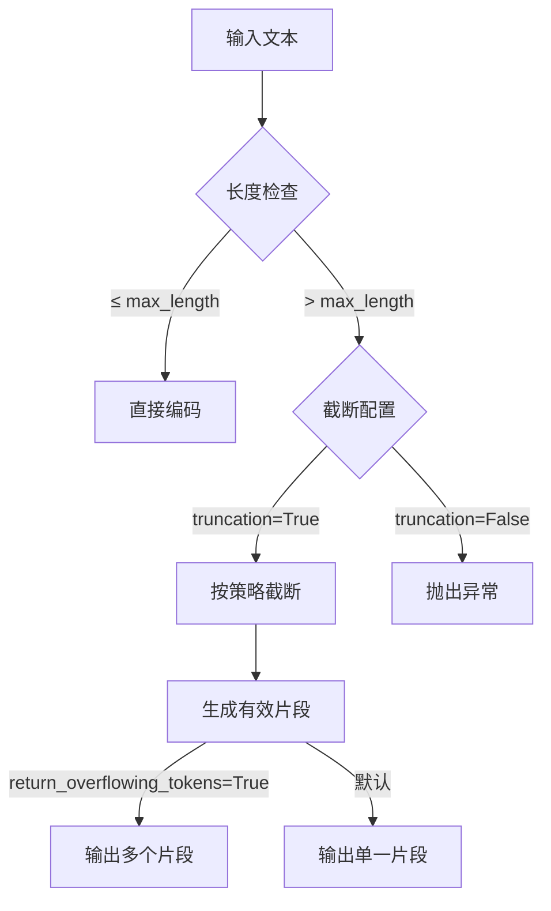

### `max_length` 参数的作用

在模型分词器（Tokenizer）中，`max_length` 参数用于**控制输入序列的最大长度（以 token 为单位）**，主要作用包括：

1. **内存/显存控制**  
   - 防止过长的序列导致 GPU 显存溢出（OOM）
   - 避免超出模型的最大位置编码限制（如 BERT 的 512 token）

2. **计算效率优化**  
   - 限制序列长度可显著减少计算量（注意力复杂度 O(n²)）

3. **模型兼容性**  
   - 确保输入符合预训练模型的架构约束（如 GPT-3 的 2048 token 限制）

4. **批量处理对齐**  
   - 使同批次样本长度一致，便于并行计算

---

### 文本超过 `max_length` 的处理方式

当输入文本超过最大长度限制时，分词器会根据配置采取以下处理策略：

#### 1. 截断（Truncation） - 最常用
```python
# 显式启用截断
tokenizer(text, truncation=True, max_length=512)

# 截断方向选项：
# - 'longest_first'（默认）：从中间或两端移除超长部分
# - 'only_first'/'only_second'：针对句子对任务
# - 'do_not_truncate'：禁用截断
```

**截断位置示例**：
- 单文本：`[CLS] 文本前部... [SEP]` → 移除尾部超长内容
- 句子对：`[CLS] 句子1 [SEP] 句子2 [SEP]` → 优先截断较长句子

#### 2. 滑动窗口（Sliding Window） - 长文档处理
```python
# 启用滑动窗口
inputs = tokenizer(
    long_text, 
    max_length=512, 
    stride=128,  # 窗口重叠步长
    return_overflowing_tokens=True  # 返回多个片段
)
```
- **输出多个子序列**（如 2000 token 文档 → 4 个 512 token 片段）
- 适用场景：文本摘要、长文档问答

#### 3. 拒绝处理（Rejection） - 严格模式
```python
# 禁用截断时直接报错
tokenizer(text, truncation=False, max_length=512) 
# 文本超长 → 抛出 ValueError
```

---

### 处理逻辑流程图


---

### 不同场景的最佳实践

#### 场景 1：分类任务（如 BERT）
```python
# 尾部截断（保留头部关键信息）
tokenizer(text, 
          max_length=512, 
          truncation=True,
          padding='max_length')  # 填充到固定长度
```

#### 场景 2：长文本生成（如 GPT）
```python
# 滑动窗口分块处理
inputs = tokenizer(text,
                  max_length=2048,
                  stride=256,
                  return_overflowing_tokens=True,
                  return_tensors='pt')

for chunk in inputs['input_ids']:
    output = model.generate(chunk)
```

#### 场景 3：保留完整信息（如法律文档）
```python
# 动态分块+聚合结果
chunks = [text[i:i+4000] for i in range(0, len(text), 4000)]
results = []
for chunk in chunks:
    inputs = tokenizer(chunk, max_length=512, truncation=True)
    results.append(model(**inputs))
```

---

### 截断策略详解
| **策略**                | 配置参数                  | 适用场景                          |
|-------------------------|--------------------------|----------------------------------|
| 尾部截断                | `truncation='longest_first'` | 通用任务（标题+正文）            |
| 头部截断                | `truncation='only_first'`    | 保留结论的关键信息（如论文结尾）  |
| 两端均衡截断            | `truncation='balanced'`      | 问答对等长文本                   |
| 句子对优先截断第二句    | `truncation='only_second'`   | 文档检索（query 比 document 重要）|

---

### 重要注意事项
1. **位置编码溢出**  
   即使物理截断文本，模型仍可能因位置编码超限产生错误（如 RoBERTa 仅支持 512 位置）

2. **关键信息丢失**  
   ```python
   # 错误示例：直接截断可能丢失答案
   text = "问题：量子纠缠的原理？答案：量子系统中..."
   # 截断后 → "问题：量子纠缠的原理？答案："
   ```

3. **长文本解决方案**  
   - 使用支持长上下文的模型（如 LLaMA-2-32K）
   - 采用稀疏注意力（Longformer、BigBird）
   - 分块+聚合策略（如 Map-Reduce）

---

### 完整代码示例
```python
from transformers import AutoTokenizer

tokenizer = AutoTokenizer.from_pretrained("bert-base-uncased")

# 场景 1：基础截断
text = "A" * 1000  # 超长文本
inputs = tokenizer(
    text,
    max_length=512,
    truncation=True,  # 启用截断
    return_tensors="pt"
)
print(inputs["input_ids"].shape)  # torch.Size([1, 512])

# 场景 2：滑动窗口
long_doc = "B" * 3000  # 3000字符
inputs = tokenizer(
    long_doc,
    max_length=512,
    stride=128,
    return_overflowing_tokens=True,
    return_tensors="pt"
)
print(len(inputs["input_ids"]))  # 输出分块数 (3000-512)/128 ≈ 6块
```

通过合理配置 `max_length` 和截断策略，可在性能与信息完整性间取得平衡。